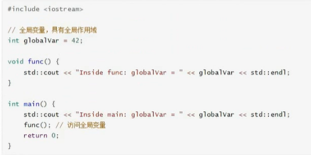
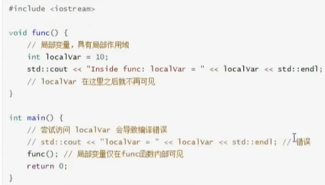
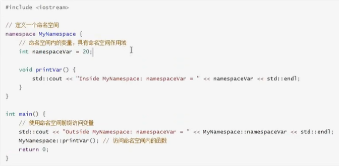
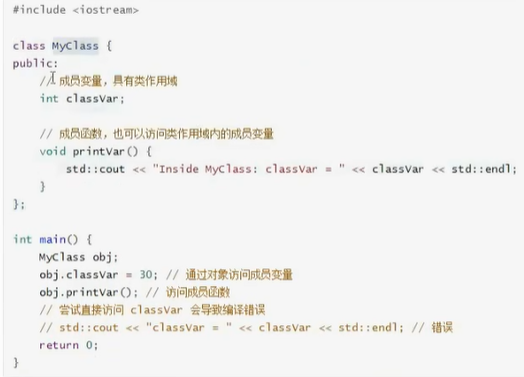
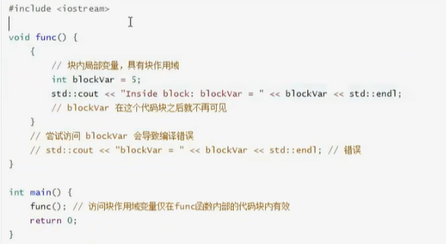

# 变量
 大小写敏感，不能以数字开头，多种数据类型
 整型：int，short，long，long long
 浮点型：float，double，long double
 字符型：char
 布尔型：bool
 还支持枚举enum，结构体struct，联合体union，类class


# 输出运算符
 输出通常通过标准输出流std::cout来完成，这是一个标准库中的对象，代表标准输出设备，通常是屏幕，需要使用头文件\<iostream\>
 <<是一个插入运算符，将右侧的数据发送到左侧的流对象，std::endl是一个操作符，用于在输出后插入换行符，并且刷新输出缓冲区，确保在屏幕上显示输出。

# bool输出
 std::boolalpha操作符是c++11及以后版本中引入的，用于控制布尔值的输出格式，此外c++还支持格式化输出，如std::iomanip头文件中定义的操作符或者c++20引入的新特性，这不是通过std::cout直接使用的，而是用于生成格式化字符串

# 变量计算
 ASC||码表是用为128字符分配了唯一的数字编码，包括引文字母，数字，标点符号和一些控制字符

# 内置类型与符合类型
 C++提供的基本类型叫内置类型
 struct和class这种自定义类型叫符合类型，引用和指针也是复合类型
 强制在内置类型中进行转换可能会导致精度丢失，所以小转大是可行的，可以用sizeof计算类型的大小

# 变量作用域
 全局作用域：在函数外部申明的变量，在程序的任何地方都可以被访问
 

 局部作用域：在函数内部，代码块内部申明的变量具有局部作用域，只能在申明它们的代码块内被访问
 

 命名空间作用域：在命名空间中申明的变量具有命名空间作用域，只能在相应的命名空间内被访问，但是可以通过使用命名空间的名称作为前缀来外部访问，其实就是为了防止变量重名，并且作用域很好用
 

 类作用域：在类中声明的成员变量和成员函数具有类作用域，成员变量和成员函数可以通过类的对象来访问，或者在某些情况下（如静态成员）可以通过类名直接访问，和命名空间的不同在于一个是需要声明，但是另一个不需要声明
 
 块作用域：局部作用域的一个特例，指的是代码块内部声明的变量，这些变量只能在该代码块中被访问

 

# 作用域的区别
 命名空间作用域​​：全局固定存储区（程序生命周期）。
​​类作用域​​：需实例化或静态绑定的专属存储空间（对象/类生命周 期）。
​块作用域​​：临时变量区（自动创建/销毁，仅块内有效）。

# 存储区域
1.代码区域：
    存储程序执行代码（机器指令），此部分内存共享并且可读，程序执行过程中不会改变
    编译C++程序的时候，所有的函数定义，控制结构都会被转换成机器指令，存储在代码区
2.全局/静态存储区：
    存储全局变量或者静态变量的内存区域，这些变量在程序的这个那个运行期间都存在，但是可见性和生命周期取决于作用域
3.栈区：
    存储局部变量，函数参数，返回地址等的内存区域，用于存储函数调用和自动变量
4.堆区：
    根据动态内存分配函数（new，malloc）分配内存区域，堆区的内存分配和释放是手动的，所以程序员需要负责管理内存，避免内存泄漏或者野指针问题
    用delete操作符可以释放堆区中的内存
5.常量区：
    存储常量（如字符串常量，const修饰的全局变量）的内存区域，这部分也是只读，并且程序执行期间不会改变
    如c++中用双引号括起来的字符串，const关键字声明的全局变量，如果值在编译的时候已经确定，那么可能存储在常量区
## 示例
```c++
#include <iostream>
#include <cstring> // 用于strlen

// 全局变量，存储在全局/静态存储区
int globalVar = 10;

// 静态变量，也存储在全局/静态存储区，但仅在其声明的文件或函数内部可见
static int staticVar = 20;

void func() {
    // 局部变量，存储在栈区
    int localVar = 30;

    // 静态局部变量，虽然声明在函数内部，但存储在全局/静态存储区，且只在第一次调用时初始化
    static int staticLocalVar = 40;

    std::cout << "Inside func:" << std::endl;
    std::cout << "localVar = " << localVar << std::endl;
    std::cout << "staticLocalVar = " << staticLocalVar << std::endl;

    // 尝试通过动态内存分配在堆区分配内存
    int* heapVar = new int(50);

    std::cout << "heapVar = " << *heapVar << std::endl;

    // 释放堆区内存（重要：实际使用中不要忘记释放不再使用的堆内存）
    delete heapVar;
}

int main() {
    // 访问全局变量
    std::cout << "Inside main:" << std::endl;
    std::cout << "globalVar = " << globalVar << std::endl;
    std::cout << "staticVar = " << staticVar << std::endl; // 注意：staticVar在外部不可见（除非在同一个文件中或通过特殊方式）

    // 调用函数，展示栈区和堆区的使用
    func();

    // 字符串常量通常存储在常量区，但直接访问其内存地址并不是标准C++的做法
    // 这里我们仅通过指针来展示其存在
    const char* strConst = "Hello, World!";
    // 注意：不要尝试修改strConst指向的内容，因为它是只读的
    std::cout << "strConst = " << strConst << std::endl;
    // 尝试获取字符串常量的长度（这不会修改常量区的内容）
    std::cout << "Length of strConst = " << strlen(strConst) << std::endl;

    return 0;
}
```
这个示例中，了全局变量、静态变量、局部变量、静态局部变量以及通过new操作符在堆上分配的内存来展示不同内存区域的使用。同时，我也提到了字符串常量，但请注意，直接访问其内存地址并不是C++编程中的标准做法，因为字符串常量通常是只读的，并且其存储位置取决于编译器和操作系统的实现。
另外，请注意，我在func函数中分配了堆内存并通过delete操作符释放了它。这是管理堆内存时的一个重要实践，以避免内存泄漏。然而，在实际应用中，更复杂的内存管理策略（如智能指针）可能更为合适。
当您编译这个程序时，编译器会将main函数和func函数的代码转换成机器指令，并将这些指令存储在可执行文件的代码区中（尽管实际上是在磁盘上的可执行文件中，但在程序运行时，操作系统会将这些指令加载到内存的代码区中）。然后，当您运行这个程序时，CPU会从内存的代码区中读取这些指令并执行它们。

# 程序编译过程
C++程序的编译过程是一个相对复杂但有序的过程，它涉及将高级语言（C++）代码转换为机器可以执行的低级指令。在这个过程中，通常会生成几个中间文件，包括.i（预处理文件）、.s（汇编文件）和.o（目标文件或对象文件）。下面是这个过程的详细解释：
1. 预处理（Preprocessing）
输入：C++源代码文件（通常以.cpp或.cxx为后缀）。
处理：预处理器（通常是cpp）读取源代码文件，并对其进行宏展开、条件编译、文件包含（#include）等处理。本质上来说就是将头文件这些东西进行直接拼接补全，全部粘贴过去。
输出：生成预处理后的文件，通常具有.i后缀（尽管这个步骤可能不是所有编译器都会自动生成.i文件，或者可能需要特定的编译器选项来生成）。
2. 编译（Compilation）
输入：预处理后的文件（如果有的话，否则直接是源代码文件）。
处理：编译器（如g++、clang++等）将预处理后的文件或源代码文件转换为汇编语言代码。这个步骤是编译过程的核心，它执行词法分析、语法分析、语义分析、中间代码生成、代码优化等任务。
输出：生成汇编文件，通常具有.s或.asm后缀。
3. 汇编（Assembly）
输入：汇编文件。
处理：汇编器（如as、gas等）将汇编语言代码转换为机器语言指令（即目标代码），但这些指令仍然是针对特定架构的，并且尚未被链接成可执行文件。
输出：生成目标文件（或对象文件），通常具有.o、.obj或.out后缀。
4. 链接（Linking）
输入：一个或多个目标文件，以及可能需要的库文件（如C++标准库）。
处理：链接器（如ld、lld等）将目标文件和库文件合并成一个可执行文件或库文件。在这个过程中，链接器会解决外部符号引用（即函数和变量的调用），并将它们链接到正确的地址。
输出：生成可执行文件（在Unix-like系统中通常是.out、.exe或没有特定后缀，在Windows系统中是.exe）。
我们将代码的CMakeList中设置编译选项，保存临时文件
## 总结
.i文件是预处理后的文件，包含了所有宏展开、条件编译和文件包含的结果。
.s文件是汇编文件，包含了将C++代码转换为汇编语言后的结果。
.o文件是目标文件或对象文件，包含了汇编器生成的机器语言指令，但尚未被链接成可执行文件。
这些文件在编译过程中扮演了重要的角色，帮助开发者理解和调试代码，同时也是编译链中不可或缺的一部分。不过，值得注意的是，并非所有编译器都会默认生成.i和.s文件，这可能需要特定的编译器选项来启用。